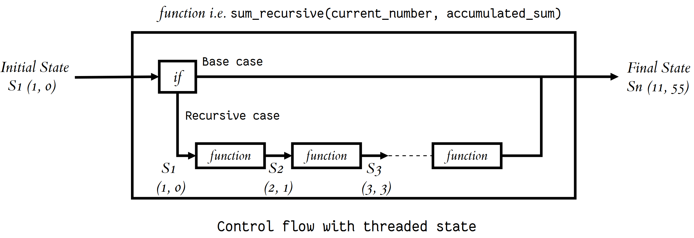

# Classes and Objects
 ## Classes
 * A template to create your objects.
 ## Objects
 * encapsulation of variables and functions into a single entity. 

### Accessing Object Variables and functions
 * obj_name.variable_name
 * obj_name.function_name()

# Thinking Recursively in Python

## Recursive Functions

## A recursive function is 
 * a function defined in terms of itself via self-referential expressions.

## Maintaining State

### maintain state during recursion you have to either:
* Thread the state through each recursive call so that the current state is part of the current call’s execution context
* Keep the state in global scope

## Recursive Data Structures in Python

* A data structure is recursive if it can be defined in terms of a smaller version of itself
* The recursive function’s structure can often be modeled after the definition of the recursive data structure it takes as an input.

# Python Fixtures and Coverage

## Fixtures 

* Fixtures are objects available to all tests and might contain data wanted to share across tests.

### define a fixture 
@pytest.fixture
def simple_file():
   return StringIO('\n'.join(['abc', 'def', 'ghi', 'jkl']))

* you can set up an object and then use it multiple times without creating it again by setting the fixture's "scope"

### inside the test
* you can access the fixture by name.

## Coverage

###  how to include code coverage with pytest
1. Download and install a package called pytest-cov on PyPI
2. Invoke pytest with the --cov option
3. Turn the coverage report into something human-readable

