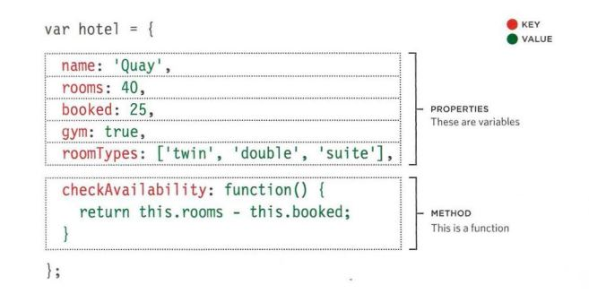
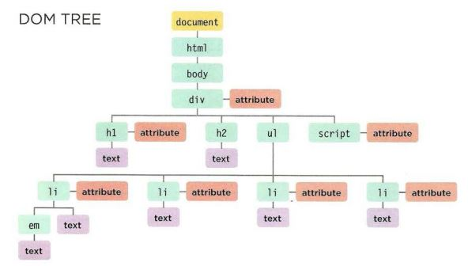

# Object 
## What is the object
> a set of variables and functions to create a modelmof a something In an object, variables and functions take on new names.
## Example of Object

## TO CREATING OBJECTs (LITERAL NOTATION method)
* Curly braces are used 
* variable to store object in 
* sperate each property and method using comma
* accessing to object is available

# Document Object Model
## DOM tree
It a model of that page that created by browser.
n
## Nodes
* DOCUMENT NODE
* ELEMENT NODES
* ATTRIBUTE NODES 
* TEXT NODES
## Examle of DOM tree

## Steps of accessing and updating the DOM tree steps: 
1. Locate the node that represents the element you want to work with. 
1. Use its text content, child elements, and attributes. 

